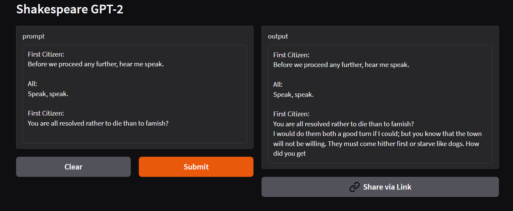
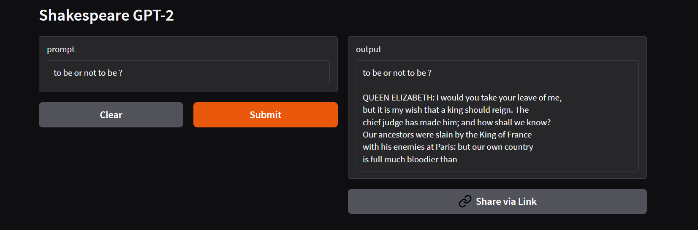
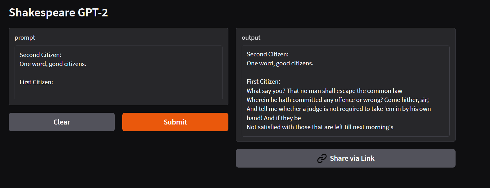

# 📝 GPT-2 LoRA Shakespeare Text Generator UI

This is a simple Gradio-based web interface for interacting with a GPT-2 `medium` model fine-tuned on Shakespeare plays using LoRA (Low-Rank Adaptation). The model is hosted on Hugging Face 🤗 and this repo serves as the front-end UI for easy text generation.

---

## 🌐 Live Demo

Try the model live on Hugging Face Spaces:  
 👉 [Launch App](https://huggingface.co/spaces/khotveer1/gpt2-shakespeare-ui)

---

## 🚀 Features

- Generate Shakespearean-style dialogue
- Customize generation parameters (e.g., max length, temperature)
- Lightweight and easy to deploy

---


## 🔗 Model

This UI uses the model available here:  
👉 [khotveer1/gpt2-medium-lora-finetuned-shakespeare](https://huggingface.co/khotveer1/gpt2-medium-lora-finetuned-shakespeare)

---

---

## 🎭 Example Outputs (UI)

Here are a few sample generations by the fine-tuned GPT-2 model on Shakespearean-style prompts:

### 📝 Prompt 1:  


---

### 📝 Prompt 2:  


---

### 📝 Prompt 3:  


> These outputs demonstrate the model’s ability to mimic Shakespearean language style effectively using low-rank fine-tuning (LoRA) on top of GPT-2.

---

🙌 Acknowledgments

- Hugging Face 🤗
- PyTorch
- Gradio
- Shakespeare!
  
---

### File Structure

```bash
gpt2-lora-shakespeare-ui/
│
├── app.py
├── requirements.txt
├── README.md
└── assets/
    ├── example1.png
    ├── example2.png
    └── example3.png
```

### 📄 License
This project is licensed under the MIT License.
